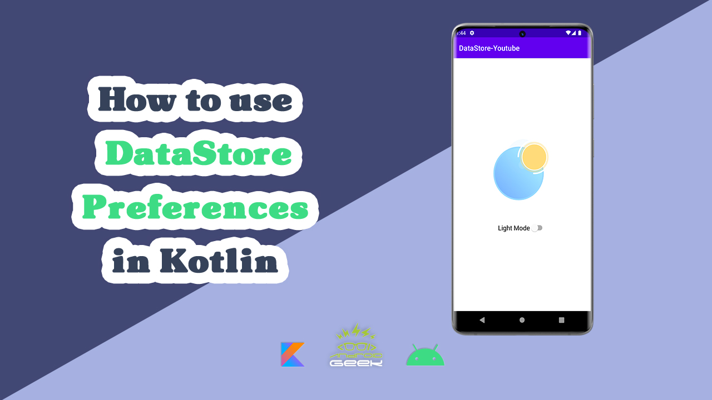

# DataStore-Youtube
</a>

YouTube Video :

Part 3
   

 
 
🗒️ Medium's Article :
https://androidgeek.co/how-to-use-datastore-preferences-in-kotlin-f1df16f17ac0
 

❇️ How to use Shared Preferences in kotlin :
https://youtu.be/p0nhM5irW7Y

 
 

✨ Join Medium to read thousands of valuable stories ✨
 
https://medium.com/@ezatpanah/membership
